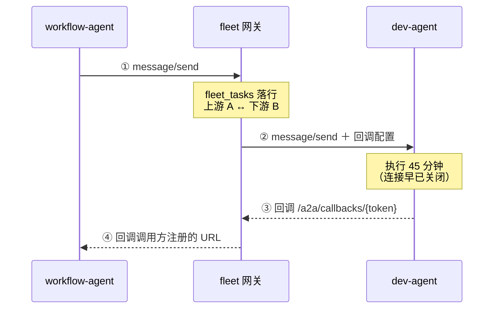
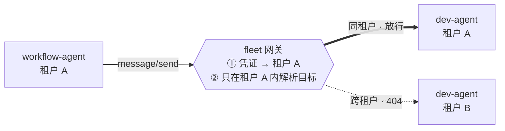

# Fleet 多租户 A2A 网关

把 fleet site 从私有 mailbox 中继改造成标准 A2A 网关：租户自助注册 agent，同租户内互相发现与派活，跨租户在路由层彻底隔离。

| | |
|---|---|
| **状态** | 草案，待评审 |
| **日期** | 2026-09-10 |
| **实现分支** | `feat/fleet-a2a-gateway` |
| **取代** | `fleet-mailbox` 轮询协议，**不保留兼容** |

文中对旧实现的代码位置引用基于 `feat/agent-fleet` @ `8965ecc`，仅用于说明被取代的是什么。

---

## 1. 决策与范围

当前 fleet site 是一个私有协议的消息中继：agent 每 5 秒轮询 `/api/mailbox/lease` 领活，干完回写 `/complete`。这套东西能跑，但对第三方开发者意味着一份必须阅读的私有规范，且没有租户概念。

本文定义的目标形态：**两端看到的都是标准 A2A，site 夹在中间同时扮演 server 和 client。** 这样 agent 开发者只需要用现成 A2A SDK，我们不维护任何 SDK；而消息仍然穿过 site，集中审计、租户隔离、配额这些能力一个不丢。

| | 决策 | 理由 |
|---|---|---|
| **D1** | site 位于消息路径上（网关模式） | 不是纯注册中心。放弃 agent 点对点直连，换取运行时可强制的租户隔离与集中审计。 |
| **D2** | 长任务用 `message/send` + push notification config | 不用 `message/stream`。任务是小时级的（现有 lease 默认 6 小时），SSE 长连接扛不住。 |
| **D3** | 严格同租户通信 | 跨租户调用在路由层不存在，不是靠权限判断拒绝，而是目标根本解析不到。 |
| **D4** | 中心化 Postgres 存储 | RLS 作为隔离的最后一道兜底。 |
| **D5** | 不保留 `fleet-mailbox` 兼容 | 全量切换，不做双 transport 并存。旧的轮询端点与 mailbox 表随改造一并删除，因此没有迁移期，也不必为存量代码打补丁。 |
| **D6** | ~~site 用云 Postgres，workflow agent 保留本地 SQLite~~ **已作废** | 组合层把编排收进网关之后 workflow-agent 整个消失了，fleet 里不再有任何本地 SQLite。见 §10.1 与 §13.1。 |

### 1.1 本期不做

- **跨租户 agent 共享。** schema 留扩展点（§10），但本期不实现任何跨租户路径。
- **反向隧道。** 让 agent 免于入站可达需要我们下发隧道客户端，那就等于发 SDK，与本方案的出发点冲突。本地开发用 `cloudflared` / `ngrok` 解决，写进文档即可。
- **计费与配额。** 只在 `fleet_tasks` 留下可计量的字段。

---

## 2. 角色划分

同一个进程在不同链路里可能是不同角色。这张表是后面所有章节的前提——尤其是 workflow-agent 的双重身份，它既要能被派活，又要能派活给别人。

| 组件 | 对 site | 对其他 agent | 说明 |
|---|---|---|---|
| `dev-agent` | server | 无直连 | 只接活，不派活 |
| `review-agent` | server | 无直连 | 同上 |
| `fleet site` | — | server + client | 面向调用方是 server，面向被调方是 client。**唯一同时持有两边真实地址的组件** |

> **隔离的地基**
>
> agent 之间**永远不会互相持有真实地址**。每个 agent 配置里只有一个网关 base URL 和自己的凭证。跨租户隔离之所以能在运行时强制，就是因为所有寻址都必须过网关这一道。
>
> 编排收进网关之后（见 [组合层](fleet-composition-layer.md)），连「调用方」也不再是某个 agent —— 一个 workflow 步骤的调用方是 run 本身。三个 agent 现在都是纯 server。

---

## 3. 寻址

每个注册的 agent 由网关分配一个对外 URL，其真实 `endpoint_url` 只存在于 site 的数据库里：

```
# 网关分配的地址（调用方唯一知道的）
https://fleet.example.com/a2a/t/{tenant}/agents/{agentId}

# 真实地址（只在 fleet_agents.endpoint_url，不外泄）
https://dev-agent.acme-corp.internal:8443/
```

| 端点 | 角色 | 用途 |
|---|---|---|
| `GET /a2a/t/{tenant}/agents/{id}/.well-known/agent-card.json` | server | 返回改写过 URL 的 agent card |
| `POST /a2a/t/{tenant}/agents/{id}` | server | JSON-RPC：`message/send`、`tasks/get`、`tasks/cancel`、`tasks/pushNotificationConfig/set` |
| `POST /a2a/callbacks/{token}` | server | 接收下游 agent 的完成回调（§7 步骤 ③） |
| `GET /a2a/t/{tenant}/catalog` | 自有 | 同租户 agent 目录。A2A 规范不定义注册中心协议，发现「有哪些 agent」属于 spec 之外，这是本系统唯一的非标端点 |

### 3.1 路径里的 tenant 不是权威来源

URL 中带 `{tenant}` 是为了日志和排障时一眼看懂，但**权威租户身份永远来自凭证**（§4）。两者不一致时返回 `404`，不是 `403`——见 §9.2。

---

## 4. 凭证的四条链路

网关模式下认证方向有四条，很容易漏掉后两条。每条的信任问题都不同。

| 方向 | 要证明什么 | 机制 | 存储 |
|---|---|---|---|
| agent → 网关<br/>（调用方发起） | 我是 `(tenant, agentId)` | 注册时签发的 Bearer token | `fleet_agent_tokens.token_hash` |
| 网关 → agent<br/>（派活） | 我是这个 fleet | 按目标 card 的 `securitySchemes`（bearer / apiKey / oauth2 / mTLS） | `fleet_agent_credentials.secret_enc` |
| agent → 网关<br/>（完成回调） | 这个回调属于任务 *T* | 一次一任务的 callback token，嵌在回调 URL 路径里 | `fleet_tasks.callback_token_hash` |
| 网关 → agent<br/>（转发回调） | 我是调用方注册回调时认可的那个 fleet | 调用方在 `pushNotificationConfig` 里自己指定的认证方案 | `fleet_tasks.caller_callback_auth` |

> **⚠ 攻击面**
>
> `/a2a/callbacks/{token}` 是一个**无会话的入站端点**，任何人都能 POST。伪造一次成功回调的后果是实打实的：攻击者告诉网关「dev 活干完了，PR 在*某个地址*」，下游 review-agent 就会真的去读那个 PR。
>
> 最低要求：token 一次一任务且随任务终结立即失效；校验 body 里的 `downstream_task_id` 确实是我们派出去的那一个；回调幂等（下游会重试）；token 比对用恒定时间。

---

## 5. 注册

现状是管理员在 Web UI 手工建行、token 只显示一次、人肉发给对方。多租户下这条路走不通，改成租户自助：

1. 租户管理员登录，**Add agent**，填入 agent 的真实 URL，以及网关调用它时需要用的凭证。
2. 网关拉取 `{url}/.well-known/agent-card.json`。
3. 校验：`agentId` 在本租户内未被占用；skills 结构合法；URL 通过 SSRF 检查（见下）。
4. 落库 card 与 skills，签发该 agent 的入站 token（只显示一次），分配网关 URL。
5. 后台按周期重新拉取 card 做健康检查，失联标记 `unreachable`，card 变更触发 skills 重建。

> **⚠ SSRF**
>
> 第 2 步是**由租户提供任意 URL、让我们的服务器去访问**，这是教科书式的 SSRF 入口。必须：强制 `https`；解析后拒绝 RFC1918、loopback、link-local（特别是云元数据地址 `169.254.169.254`）与 IPv6 对应段；限制重定向跳数并对每一跳重新校验；设连接与读取超时。
>
> 注意要防 DNS rebinding：校验时解析到的 IP 和真正发起连接时的 IP 必须是同一个（解析一次、拿着 IP 直连并带 SNI，或用带校验钩子的 HTTP 客户端）。

skills 的 `inputSchema`（JSON Schema）在这一步落库。这是原来只有 `id/name/description` 三个字符串所缺的东西，也是让第三方不必读我们源码就能对接的关键。

---

## 6. 租户内发现

一个租户注册多个 agent 之后，它们靠 `GET /a2a/t/{tenant}/catalog` 互相发现。调用方带自己的 agent token，网关**只返回同租户的条目**，每条包含网关 URL 和完整 card：

```jsonc
// GET /a2a/t/acme/catalog?skill=develop.issue
{
  "agents": [
    {
      "agentId": "dev-agent",
      "url": "https://fleet.example.com/a2a/t/acme/agents/dev-agent",
      "health": "healthy",
      "card": { /* 标准 A2A AgentCard，url 已改写 */ }
    }
  ]
}
```

拿到 `url` 之后，后续全部是标准 A2A —— 调用方把它交给现成的 A2A client 即可。目录本身是唯一的非标接口，而它只是「列出有哪些」，语义足够简单，文档一段话说得完。

### 6.1 同技能多 agent 时，网关不替你选

现在的代码是 `GET /api/agents?skill=...` 然后取 `agents[0]`。租户内同一技能存在多个 agent 是常态（灰度、不同仓库、不同模型），盲取第一个会静默路由到错误的 agent，而这类 bug 极难排查。

新规则：**目录返回全部匹配项，由调用方显式选定 `agentId`。** 网关不做隐式选路，也不做负载均衡。如果将来确实需要，再引入显式的 alias（`@develop` → 某个具体 agent），由租户配置，而不是让系统猜。

---

## 7. 派发与回调

这是整个方案最核心、也最容易低估的部分：**回调链是双段的**。网关必须在中间把两段任务关联起来并持久化，否则下游回调回来时不知道该通知谁。



一次派活产生两个任务、两次回调。① 和 ② 是两次独立的 `message/send`，各自生成一个 task id；③ 到达时网关必须靠 `fleet_tasks` 才能从下游任务 B 找回上游任务 A，进而知道 ④ 该打给谁。中间那 45 分钟里没有任何连接存活。

### 7.1 每一步的持久化

| 步骤 | 网关的动作 | 写入 |
|---|---|---|
| **①** 收到调用 | 鉴权得到 `(tenant, caller)`；在同租户内解析目标；生成上游 task id；取出调用方已注册的 `pushNotificationConfig` | `fleet_tasks` 新行，`state=dispatching` |
| **②** 转发下游 | 生成一次性 callback token；用目标的出站凭证调 `message/send`，`pushNotificationConfig` 指向自己 | `downstream_task_id`、`callback_token_hash`，`state=running` |
| **③** 收到下游回调 | 按 token 查行；校验任务归属与状态；幂等丢弃重复回调 | `result_json`，`state=done_pending_notify`；token 失效 |
| **④** 通知调用方 | 按 `caller_callback_auth` 打调用方的 webhook；失败进退避重试队列 | 成功：`notified_at`，`done_pending_notify` 收敛为 `done`；失败：`attempt++` 与 `next_retry_at` |

### 7.2 任务状态机与送达标记

**结局（`state`）和送达（`notified_at`）必须是两个独立的字段。** 这是实现时踩出来的：最初只有 `state`，通知队列按 `state = 'done_pending_notify'` 过滤，结果被 sweeper 判为 `timed_out` 的任务永远进不了队列——上游会一直等一个不会来的回复，而这恰恰是 §8「超时清扫」本来要解决的问题。

```
结局：  dispatching → running → done_pending_notify → done
                             ↘ failed / timed_out / cancelled

送达：  notified_at IS NULL  →（投递成功 / 放弃投递）→ notified_at = now()
```

`done_pending_notify` 是个必须存在的独立状态：下游已经把活干完了，但我们还没成功告诉上游——这两件事之间可以隔很久（调用方在重启、网络不通），期间任务既不是 running 也不能算 done。

通知队列的谓词是 **`notified_at IS NULL`**，而不是某个具体结局，因此成功、超时、失败都会被送达。三条由此而来的规则：

- **放弃投递不改写结局。** 重试预算耗尽时只盖 `notified_at`。下游真干成了就是干成了，`tasks/get` 必须继续这么说——这正是 §8 对账那条路径的依据。
- **派发失败不进队列。** `message/send` 当场失败时调用方已经从同步的 JSON-RPC 错误里知道了，落库时直接盖上 `notified_at`。
- **成功才收敛到 `done`。** `timed_out` / `failed` 送达后保留原结局。

---

## 8. 可靠性

> **⚠ 迁移的净增工作量**
>
> 现在的 pull 模型**白送**了可靠投递：lease 到期消息自动回到队列，agent 崩了重启就能接着领，代码里一行重试逻辑都没有。换成 push 之后这个属性消失了——④ 那一步如果调用方正在重启，通知就丢了。下面三件事是必须新写的，别漏算工期。

- **持久化 + 退避重试。** ④ 失败要重投，指数退避加抖动，设最大尝试次数。`fleet_tasks(state, next_retry_at)` 上建索引，后台 worker 扫描。
- **幂等。** ③ 会被下游重试，④ 会被我们重试。两端都要能安全接收重复投递，靠 task id 去重。
- **对账兜底。** 调用方必须能主动 `tasks/get` 查状态。重试是尽力而为，对账才是最终一致的保证。
- **超时清扫。** 下游永不回调时，靠 `deadline_at` 扫描把任务判为 `timed_out` 并通知上游。`fleet_tasks(state, deadline_at)` 上建索引。

> **旧实现的教训：超时必须三方共识**
>
> 旧代码里 `PollingWorkflowMailbox` 的默认超时是 30 分钟（`src/fleet/agents/workflow/handler.ts:109`），而 worker lease 是 6 小时（`src/fleet/runtime/worker.ts:36`）。dev-agent 干 45 分钟的话，workflow-agent 早已超时放弃，而 dev-agent 还在闷头干、干完照常 complete，结果是一个没人认领的成功任务。
>
> 新模型里 `deadline_at` 必须是网关、调用方、被调方三者共识的同一个值：网关在 ② 里把它明确传给下游，并在 ① 的响应里回给上游。

---

## 9. 跨租户隔离



**跨租户不是「有权限但被拒绝」，而是「目标不存在」。** 网关先由凭证定出调用方租户，再*只在该租户内*查找目标 agent；另一租户的同名 agent 根本不在查找集合里，因此走的是标准的「未找到」分支，而不是一个需要正确实现的权限判断。

### 9.1 六层防御

| 层 | 措施 | 失守后果 |
|---|---|---|
| **1** 身份 | 每个 token 绑定唯一 `(tenant_id, agent_id)`，租户身份不可由请求参数指定 | 身份冒充 |
| **2** 路由 | 目标解析的 `WHERE` 恒带调用方 `tenant_id`；不匹配即 404 | 跨租户派活 |
| **3** 发现 | catalog 按租户过滤，不泄漏其他租户的 `agentId` 与技能 | 信息泄漏、可枚举 |
| **4** 回调 | callback token → task → tenant 三者绑定；回调只能推进自己那一行 | 伪造完成、串号 |
| **5** 数据 | 所有表带 `tenant_id`；`UNIQUE (tenant_id, agent_id)` | 命名冲突、越权读写 |
| **6** 数据库 | Postgres RLS，每请求 `SET LOCAL app.tenant_id` | —（这是兜底层） |

前五层都是「某个查询别忘了加 `WHERE tenant_id`」。靠人肉保证二十几个数据访问方法一个都不漏，迟早会漏一次，而这类疏漏直接等于数据泄漏。第 6 层的意义就在于：**就算漏了，数据库也返不出别家的行。**

### 9.2 为什么是 404 而不是 403

`403` 等于确认「这个 agent 存在，只是你不能访问」。攻击者据此可以枚举出其他租户注册了哪些 agent、叫什么名字。`404` 不泄漏存在性。同理，路径里的 `{tenant}` 与凭证不符时也返回 `404`。

### 9.3 RLS 的一个实现陷阱

回调端点 `/a2a/callbacks/{token}` 必须**先查库才能知道租户是谁**——它没有会话，租户信息就藏在 token 对应的那一行里。这跟「先 `SET LOCAL app.tenant_id` 再查询」是鸡生蛋问题。

解法：用一个 `SECURITY DEFINER` 函数（或一个绕过 RLS 的专用角色）单独完成 token → `(tenant_id, task_id)` 这一步解析，拿到租户后立刻 `SET LOCAL`，后续所有操作回到 RLS 之下。这个函数要严格限制为只按 token hash 精确查找、只返回这两个字段。

---

## 10. 数据模型

全新 schema，不承接旧的 `fleet_messages` / `fleet_message_events`，因此没有迁移负担。但仍然要求**一开始就把 `tenant_id` 加到全部表上**，哪怕初期只有一个默认租户、代码里还不用——空表上加列是零成本，有数据之后再加列、回填、改光所有查询要贵一个数量级。

### 10.1 数据归属

**全部归网关。** 原本 D6 划了一条「平台级 / 个人级」的线，让 workflow-agent 把编排状态留在本地 SQLite。组合层落地后这条线消失了 —— 编排成为平台能力，workflow-agent 不复存在，fleet 里没有任何本地 SQLite。

| 状态 | 存放 |
|---|---|
| 租户、用户、agent 注册、`fleet_tasks`、审计事件 | InstaCloud Postgres `agent-db` |
| workflow 定义与运行实例、状态变迁流水 | 同上 |

连接方式：`DATABASE_URL` 通过 `insta secrets bind DATABASE_URL postgres/agent-db --to compute/<site>` 注入 site 的 compute env；本地开发用 `insta run -- <cmd>` 注入。`FLEET_DB_PATH` 和 `WORKFLOW_DB_PATH` 都已废弃。

**`agent-db` 目前是 scale-to-zero**（`always_on: false`）。回调端点会在长时间空闲后被突然唤醒 —— 下游干了 45 分钟才回调，冷启动正好打在这条最不该慢的路径上。连接池的 `idleTimeoutMillis` 必须小于挂起窗口，或者直接给这个库开 `insta db always-on on`。

---

## 11. 实施顺序

`fleet-mailbox` 全量退场（D5）。没有双 transport 并存期，也不需要为存量端点打补丁——原先列为「必须先堵」的几个安全缺口，随承载它们的代码一起消失。

### 11.1 直接删除

| 删除对象 | 位置 |
|---|---|
| `POST /api/mailbox/lease`、`/send`、`/messages/*`（含 `complete`、`fail`、`events`） | `src/fleet/site/http.ts:527-623` |
| `POST /api/agents/heartbeat`、`PUT /api/agents/:id/card` | `src/fleet/site/http.ts:495-526` |
| `fleet_messages`、`fleet_message_events` 两张表及其 store 方法 | `src/fleet/site/store.ts:355-490` |
| 轮询 worker 运行时（`runWorkerOnce` / `runWorkerForever` / `createFleetHttpClient`） | `src/fleet/runtime/worker.ts` 整个文件 |
| `PollingWorkflowMailbox` 与 `waitForMessage` | `src/fleet/agents/workflow/handler.ts:100-215` |
| `AgentCard.transport` 字段、`MailboxMessage` 系列类型 | `src/fleet/protocol/types.ts` |

`GET /api/agents`（`http.ts:624`）不是删除而是**替换**为 §6 的租户内 catalog；`effectiveAgentStatus` 那套基于心跳 TTL 的在线判定，改为 §5 步骤 5 的 card 健康检查。

### 11.2 原样保留

改造的是传输层，不是业务逻辑。以下不动，只把入口从 mailbox 消息换成 A2A 请求：

- `createDevAgentHandler` / `createReviewAgentHandler` / `createPrMergeHandler`
- `runDevelop` 及 `src/capabilities/**` 下的全部能力实现
- 配置、日志、以及 Slack / Discord 角色路由（那条线与 fleet 无关，完全不受影响）

### 11.3 构建顺序

1. **网关骨架。** 租户模型 + `fleet_tasks` + `POST /a2a/t/{t}/agents/{id}` 的 `message/send` 转发。先只跑一个默认租户，隔离逻辑照写，只是数据上还看不出效果。
2. **回调闭环。** `/a2a/callbacks/{token}` + 状态机 + 退避重试 + 超时清扫。这步通了就意味着 §7 那张图整条链路打通。
3. **review-agent。** 只有一个技能 `review.pr`，输入输出最清晰，拿它做第一个端到端验证。
4. **dev-agent。** 两个技能且带修订语义（`develop.revise` 需要 `priorPrUrl`），用来验证 `inputSchema` 的表达力够不够。
5. **workflow-agent。** 同时是 A2A server 和 client，且是唯一需要注册自己 `pushNotificationConfig` 的一方，复杂度最高，放最后。
6. **放开多租户。** 自助注册 UI、catalog、RLS、404 语义。前五步已经把 `tenant_id` 铺好，这一步只是打开它。

---

## 12. 未决问题

> **⚠ 规范版本**
>
> 本文涉及的 A2A 细节（`message/send`、`tasks/get`、push notification config、`.well-known/agent-card.json`、三种 transport 绑定）停留在 2026 年 5 月的认知。**动手前请先核对当前 spec 版本**，尤其是 transport 绑定（JSON-RPC / gRPC / HTTP+JSON）与 agent card 的确切路径，不要照本文直接写。

- **网关要不要透传 `message/stream`？** 本期决定只支持 `message/send`。但若某个 agent 的 card 声明了 streaming 能力，网关改写 card 时应当把它摘掉，避免调用方按能力去调一个我们不转发的方法。
- **`tasks/cancel` 怎么向下游传播？** 上游取消时网关需要调下游的 cancel，而下游可能不支持。取消是尽力而为，还是要在 card 里声明为必需能力？
- **出站凭证存在哪？** `secret_enc` 用 KMS 信封加密还是 `pgcrypto`？前者运维重，后者密钥和密文同库，需要评估威胁模型。
- **card 变更与在途任务。** agent 在有任务在途时改了 card、删掉了某个 skill，怎么处理？倾向于：在途任务按派发时的快照继续，新派发按新 card。需要在 `fleet_tasks` 存 skill 快照吗？
- **租户级配额。** 并发任务数、回调重试预算、注册 agent 上限——本期不做，但限流点应该放在网关的哪一层？

---

## 13. 实现记录：与设计的偏差

实现完成后，有三处与前文的理想模型不同。记在这里，因为它们改变的是运维预期，不是代码细节。

### 13.1 ~~workflow-agent 等待下游时走轮询~~ —— 已随组合层消失

原本记的是：workflow-agent 的 saga 是一个运行中的 async 函数，需要返回值才能继续，所以它轮询 `tasks/get` 而不是被 webhook 唤醒；代价是进程重启会丢失在途 saga。

[组合层](fleet-composition-layer.md)把编排收进网关之后，这个问题**结构性地不存在了**：没有常驻 saga，run 就是一行记录，每个步骤的完成回调触发一次状态推进。重启不丢任何东西，workflow-agent 本身也已删除。

### 13.2 agent 侧的任务登记是内存态

`InMemoryTaskStore`（`runtime/a2aServer.ts`）。agent 重启会丢掉在途任务，不像旧的 lease 模型那样会自动回到队列。

系统仍然优雅降级而不是挂死：网关的 `deadline_at` 清扫会把任务判为 `timed_out` 并通知上游（§8）。需要抗重启的 agent 把这个类换成持久实现即可，接口已经隔离好。

### 13.3 `agentId` 由网关在注册时分配

A2A 规范的 AgentCard **没有 id 字段**——agent 由 URL 标识。所以 `agentId` 不从 card 里读，而是注册时（§5 第 3 步）由租户指定、网关校验唯一性后写入注册表。card 本身保持规范形态。

这也是 `UNIQUE (tenant_id, agent_id)` 能成立的前提：同一个 agent 镜像在两个租户里可以叫不同的名字，或者叫同一个名字。
