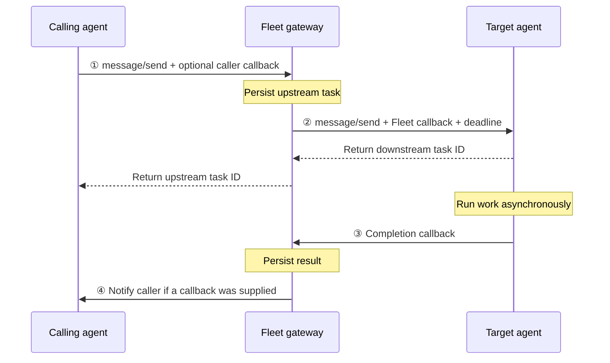

# Fleet Multi-tenant A2A Gateway

This document describes the gateway in Fleet 0.1.0. Fleet registers agents, routes messages within a tenant, persists task state, and advances workflows when agents report completion.

For Agent Card and message examples, see [How to integrate an agent](how-to-integrate-agent.md). For setup and the full endpoint reference, see the [README](../README.md).

## 1. Scope

Fleet sits in the message path: it is a server to callers and a client to registered agents. Agents run independently and do not need a Fleet SDK.

The gateway supports JSON-RPC `message/send` and `tasks/get`, with asynchronous completion callbacks. It implements a subset of A2A and has wire-format differences that can require adaptation for strict SDKs; see the [integration guide's compatibility limits](how-to-integrate-agent.md#current-sdk-compatibility-limits).

## 2. Roles

| Component | Responsibility |
|---|---|
| Calling agent | Discover a target, send work through Fleet, and receive a callback or query task status |
| Target agent | Accept work at its registered endpoint and report completion |
| Gateway | Authenticate callers, resolve same-tenant targets, dispatch work, and persist results |
| Composition layer | Store workflow definitions and runs, then choose and dispatch the next step |
| Console | Let signed-in users register agents, send messages, and manage workflows |

Workflow orchestration runs inside the gateway. Each workflow step uses the same task ledger and downstream callback path as an agent-initiated call.

## 3. Addressing and endpoints

Callers address a registered agent through its gateway URL:

```text
https://fleet.example.com/a2a/t/{tenant}/agents/{agentId}
```

Fleet stores the agent's actual endpoint separately and dispatches to that endpoint. The gateway card rewrites `url` to the gateway address, removes `securitySchemes`, and advertises `streaming: false` and `pushNotifications: true`.

| Endpoint | Purpose |
|---|---|
| `GET /a2a/t/{tenant}/agents/{id}/.well-known/agent-card.json` | Return the registered card with gateway-facing fields rewritten |
| `POST /a2a/t/{tenant}/agents/{id}` | JSON-RPC `message/send` and `tasks/get` |
| `POST /a2a/callbacks/{token}` | Receive a downstream completion |
| `GET /a2a/t/{tenant}/catalog` | List agents in the caller's tenant; optionally filter by `skill` |

The tenant in the path must match the tenant resolved from the bearer token. A mismatch or a target outside that tenant returns `404`.

The console uses session-authenticated `/api/*` routes. Machine routes do not accept console session cookies.

## 4. Credentials

| Direction | Credential |
|---|---|
| Calling agent → gateway | Inbound Fleet bearer token issued at registration, stored as a SHA-256 hash |
| Gateway → target agent | Outbound credential configured during registration or an update |
| Target agent → completion endpoint | Per-task token in the supplied callback URL |
| Gateway → calling agent's webhook | Credentials supplied in the caller's `pushNotificationConfig.authentication`, sent as a bearer token |

Registration tokens are shown once. Rotation revokes earlier inbound tokens for that agent. They are separate from per-task callback tokens.

Outbound credentials are encrypted with AES-256-GCM using `FLEET_SECRET_KEY`, a 32-byte key supplied as 64 hexadecimal characters. The outbound client sends bearer/OAuth2 secrets as bearer headers and API keys in the configured header (default `x-api-key`). It does not perform OAuth token acquisition or renewal. The console registration form exposes bearer credentials. Although the credential type includes mTLS, the client does not configure certificates.

See [secretBox.ts](../src/fleet/site/secretBox.ts) and [a2aClient.ts](../src/fleet/site/a2aClient.ts).

## 5. Registration and health

1. A signed-in user provides an agent ID, endpoint URL, and optional outbound credential.
2. Fleet fetches `/.well-known/agent-card.json` at the endpoint's origin root. This request does not include the outbound credential.
3. Fleet checks tenant-local ID uniqueness and validates the card and skills.
4. Fleet stores the card and skills and issues the agent's inbound token.
5. A background sweep refreshes cards and health every five minutes by default.

Agent IDs contain 3–64 lowercase letters, digits, or hyphens and begin and end with an alphanumeric character. The ID is a Fleet registry value supplied at registration, not a field read from the card.

The default card-fetch policy requires HTTPS, rejects private, loopback, and link-local destinations, revalidates redirects, and pins DNS resolution for the connection. Card probes have response and body-read timeouts. Failed probes mark agents `unreachable`; successful probes refresh their registered skills. Probe writes check the captured record version and identity so a stale probe cannot overwrite a concurrent edit or recreate a deleted agent.

Registered skills contain `id`, `name`, `description`, and optional `inputSchema`. The latter is a Fleet-specific JSON Schema field. The console validates a single structured message payload against it before creating a task; workflow-editor checks are advisory. Agents still need to validate incoming inputs.

## 6. Discovery and skill selection

`GET /a2a/t/{tenant}/catalog?skill=review.pr` returns matching agents from the authenticated caller's tenant. Each entry includes `agentId`, a gateway URL, health, and the rewritten card.

For direct calls, the caller selects a target through its gateway URL. `params.metadata.skillId` selects the skill; it can be omitted only when the target advertises exactly one skill.

Workflow dispatch resolves targets by skill. No match fails with `no_agent`; multiple matches fail with `ambiguous_agent`. The current workflow format does not expose an agent selector, so a workflow skill must have exactly one matching agent in its tenant. Fleet does not load-balance these matches.

## 7. Dispatch and callbacks



### 7.1 Task persistence

The gateway creates a `fleet_tasks` row before dispatch. It records the tenant, caller, target, skill, deadline, and optional caller callback. After the target returns its task ID, Fleet attaches that ID and the callback-token hash and sets the task to `running`.

Upstream and downstream IDs are different. Callers use the upstream ID with Fleet's `tasks/get`; targets report their downstream ID in callbacks.

The outbound request forwards message parts and includes `skillId`, `deadlineAt`, and a correlation `contextId` in `params.metadata`. Workflow payloads are sent as one data part. The shared deadline is also returned to the caller.

### 7.2 Receiving completion

The callback handler resolves the URL token against a live task. It accepts `taskId` or `id` in the body and rejects a supplied ID that differs from the stored downstream ID. Integrations should always include that ID.

The handler reads `status.state`, top-level `result`, and top-level `error`; it does not extract Task artifacts. It stores this result envelope and changes a `running` row to `done_pending_notify`. Repeated callbacks cannot overwrite the result once the task has left `running`.

This endpoint is for final completion, not progress updates. The callback token is attached only after dispatch returns, so an agent finishing immediately may need to retry an early callback. Token cleanup occurs when the task is settled or delivery is abandoned; subsequent requests with an invalid or terminal-task token return `404`.

### 7.3 Results and delivery

Task state and notification delivery are tracked separately:

- `dispatching` and `running` track work in progress.
- `done_pending_notify` records a received downstream completion; the downstream outcome remains in `result_json`.
- `notified_at` records completed or abandoned delivery.
- Notification settlement changes `done_pending_notify` to `done`; gateway failures and timeouts retain their states.

The caller notification worker handles eligible terminal results with `notified_at IS NULL` and a callback URL. Workflow-owned steps are excluded and claimed by the composition driver instead. Console-originated messages have no browser webhook; the console polls task results.

## 8. Reliability and workflow execution

Caller notifications use persisted retries with exponential backoff and jitter: by default, a 30-second base, a 30-minute cap, and eight attempts. Exhausting the delivery budget marks notification delivery abandoned without rewriting the recorded outcome. Callers can still query their tasks.

A deadline sweep marks overdue tasks `timed_out`. The default task deadline is six hours. Dispatch failures are recorded and returned synchronously; the gateway does not automatically replay every failed `message/send`.

Background workers run notification, timeout, and workflow processing every 15 seconds by default. Database queue claims use transactions and `FOR UPDATE SKIP LOCKED`. Notifications may be delivered more than once, so recipients must handle duplicates.

Workflow runs and step provenance are persisted in Postgres. The driver advances from the task's recorded workflow state and uses the run's awaited task ID to reject stale completions. A per-tenant admission limit, `FLEET_MAX_CONCURRENT_RUNS_PER_TENANT` (default 10), queues excess runs and starts them as slots become available.

A known limitation remains: a transient dispatch failure on a run's first step can leave it without a task to drive a retry. The bundled agent runtime also uses an in-memory task store, so agent restarts lose its in-flight work; Fleet's deadline sweep bounds the wait.

See the [composition layer](fleet-composition-layer.md) for workflow behavior.

## 9. Tenant isolation

### 9.1 Identity and routing

Each inbound token resolves to one tenant and agent. Target lookup and catalog discovery use that tenant. A caller cannot select another tenant through request parameters.

`tasks/get` also checks that the requested task belongs to the calling agent. Registry IDs are unique within a tenant through `UNIQUE (tenant_id, agent_id)`.

### 9.2 Database enforcement

Tenant-scoped access uses `withTenant`, which begins a transaction, switches to the unprivileged `fleet_app` role, and sets `app.tenant_id`. RLS policies enforce tenant visibility underneath application queries. Switching roles matters because the connection pool's table-owner role bypasses RLS.

### 9.3 Token lookups and background work

Agent-token and callback-token lookups run through the owner connection because the tenant is not known until the token is resolved. They use exact token-hash lookups; callback resolution excludes terminal tasks.

Cross-tenant background processing also uses the owner connection. This is the current implementation, rather than a dedicated `SECURITY DEFINER` lookup function.

## 10. Storage and operation

Postgres stores tenant membership, agent registrations, credentials, task records and events, workflow definitions, runs, and transition history. Configure the connection with `DATABASE_URL`; apply the numbered SQL files with `npm run migrate`.

`FLEET_PUBLIC_BASE_URL` must be reachable from agents because Fleet builds callback and gateway-facing URLs from it. `FLEET_SECRET_KEY` must remain available to decrypt stored outbound credentials.

### 10.1 Connection pool

The pool defaults to ten connections, a ten-second idle timeout, TCP keepalive, and TLS certificate verification. An idle-client error listener lets the pool discard broken connections without crashing the process, including after a database suspension.

Deployment instructions and environment setup are in the [README](../README.md#quick-start).
